## Decoding UFO Sightings: Patterns, Perceptions and Possibilities
Using a dataset of over 80,000 documented UFO sightings from 1910 to 2014, this project examined trends over time, identified active states, categorized sightings by shape, and created geovisualizations to map patterns in the United States. Predictive modeling was then applied to forecast sightings by state and shape, providing valuable insights into the UFO phenomena for researchers and enthusiasts alike.

## Project 1: Team Picard
Team Picard is composed of Dipesh Pandya, Alexis Wukich, and Erica Yanoshak.

Our team initially met to discuss potential Project 1 topics for our AI and Machine Learning course through the University of Pennsylvania's College of Liberal and Professional Studies. One of our team members is a UFO enthusiast who suggested working with the UFO Sightings database we had previously reviewed during Module 5 of our course. We felt comfortable using a dataset the curriculum team had previously vetted.

# Background
Humans have long been captivated by the mysterious objects observed in our skies—dating back as far as 1459 B.C. Recent reports from Congress, the Pentagon, and various intelligence agencies have confirmed that some of these sightings represent genuine, unidentified phenomena. Our team recognized that by sharing open data and conducting evidence-based research, we could contribute to public understanding of an issue that holds widespread fascination. Inspired by [NASA’s 2023 UAP Report](https://smd-cms.nasa.gov/wp-content/uploads/2023/09/uap-independent-study-team-final-report.pdf), which emphasizes the importance of AI and machine learning in identifying rare phenomena, we sought to apply these tools to a century’s worth of UFO data, aiming to uncover patterns, predict future occurrences, and answer the following questions:
* **What can we learn about previously documented and recorded UFO sightings?**
* **What is the trend?**
* **How do we utilize the trend to predict future sightings?**


# Repository Files
* [**ufoSightings.csv**](./Resources/ufoSightings.csv): Our original dataset which is available in the “Resources” folder in the Repository
* [**Team_Picard_Final.ipynb**](./Resources/Team_Picard_Final.ipynb): Completed notebook with data analysis and visualizations
* [**Images**](./Images) 
* **Presentation**
    * [**Presentation in PDF**](./Resources/Team_Picard_Final_Presentation.pdf)
    * [**Presentation in PowerPoint**](https://docs.google.com/presentation/d/1eNhbk_kUyeRnxmjMLCjextAWa-JeS9ia_uP-Flg4T7o/edit?usp=sharing)

# Methodology
## Phase 1: Cleaning and filtering the dataset to improve its usability and narrow the scope of our project
We began our project using the ufoSightings.csv file, which contained more than **80,000** documented UFO sightings from approximately 1910 to mid-2014. This data was collected and compiled by The National UFO Reporting Center (“NUFORC”). We imported the ufoSightings.csv file and saved it as a DataFrame, ufo_sightings_df. We completed the following steps to make the DataFrame manageable for our project:
1. Converted datetime column to a datetime object Sliced the “countries” column to include on the United States
2. Dropped blank rows using dropna Removed columns that were not relevant to our analysis: “duration (hours/min),” “comments,” and “date posted”
3. Converted “duration (seconds)” column to a float for use later with aggregations.
4. Extracted the year from the datetime column and added it to a separate “year” column.

After cleaning the data, we were left with a more functional DataFrame, cleaned_us_ufo_df.

## Phase 2: Identifying the most active period and states for UFO sightings
In phase two, we began analyzing the data. We started to see how UFO sightings had changed over time. Given the number of sightings, we grouped the data by year, as demonstrated in the frequency, duration, and sum of UFO sightings by year. 

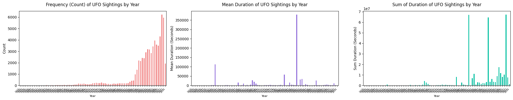

Zooming into [**Figure 2.1: Frequency (Count) by Year**](./Images/Figure_2.1_FrequencyCount.png), we can see that UFO sightings stayed relatively steady but began to increase in the early to mid-1990s. In 1994, the number of UFO sightings went from 221 to 313, and since our dataset ended in 2014, we elected to further narrow our data to the twenty years from 1994 to 2014, contained in a new DataFrame, cleaned_us_ufo_df_new.

Since we had identified the most active years for sightings, we wanted to determine the most active states for sightings. Using cleaned_us_ufo_df_new, we identified states in the ninetieth percentile for either the number of sightings (count) and average duration of sightings and saved the results as a new DataFrame, us_ufo_state_top_df. The states in the 90th percentile for sightings included Arizona, California, Florida, Hawaii, Louisiana, Mississippi, New York, Texas, Virginia, and Washington.

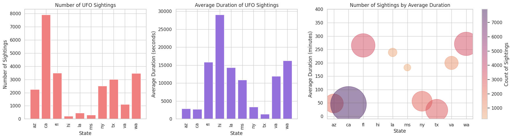

We expected there would be a positive correlation between count and average duration, but this was disproven after analyzing the tables and graphs. There was, however, a moderately strong negative correlation between the count and average duration of sightings seen in [**Figure 2.5: Count and Duration Correlation Plot**](./Images/Figure_2.5_CountDurationCorrelation.png).


## Phase 3: Shapes
We were able to learn more about UFO sightings beyond their locations. The dataset provided a column “shape,” which identified the shape of the sighting. Before cleaning the data, there were twenty-eight unique types of shapes, which was cumbersome for analysis. To improve the data’s manageability, we broke the categories into six broader groups: “'circular,” 'light,” 'triangle,” "formation_changing,” "geometric,” and "other_unknown.” We added a column to the DataFrame, “form,” to the DataFrame, which classified each sighting as one of the broader categories based on the shape.

* circular = cigar, circle, round, sphere, oval, egg, cylinder, disk
* light = fireball, flare, flash or light
* triangle = chevron, delta, triangle, pyramid or cone
* formation_changing = formation, changed or changing
* geometric = diamond, hexagon, crescent, cross, rectangle or teardrop
* other_unknown = other or unknown

### 3.1 All 50 States and Shapes
In phase three, we analyzed the data by shape to see how the various shapes impacted the data. Given the number of sightings, we grouped the shape data by year and state to see how UFO sightings changed over time and space.

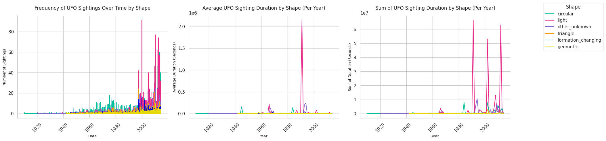


### 3.2 Top Ten States and Shapes

We then completed the same process on the top ten states to gain more detailed insights into what this data can tell us. 

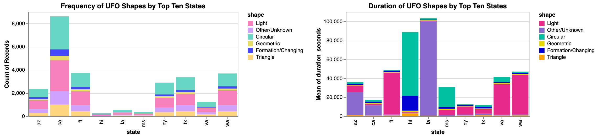


## Phase 4: Predictions 

### 4.1 Predictions: Top Ten States 
We filtered our cleaned_us_ufo_df_new DataFrame by each of the top ten states, and excluded 2014 since it was a partial year with only five months of data. Using these filtered results, we created ten state-specific pivot tables for each state: Arizona, California, Florida, Hawaii, Louisiana, Mississippi, New York, Texas, Virginia, and Washington, aggregating the duration of sightings over datetime.

Using the data from our pivot tables, we completed the following steps for Arizona, California, Florida, Hawaii, Louisiana, Mississippi, New York, Texas, Virginia, Washington, and National: 
1. We created an instance of Prophet model and fit the model with each state-specific DataFrame
2. Created state-specific future DataFrames to hold predictions for ten years
3. Used the predict method to calculate future sights for each state and then plotted the forecast and components for all of the top ten states.

### 4.2 Predictions: Shape Data in Top Ten States
Working off of the dataframe used for state predictions, we made a copy of cleaned_us_ufo_df_new, labeled form_cleaned_us_ufo_df_new, and added added the “form,” to classify each sighting as one of the broader categories based on the shape: circular, light, triangle, formation_changing, geometric, and other_unknown.

Similar to our Top Ten State predictions, we completed the following steps for circular, light, triangle, formation_changing, geometric, and other_unknown: 
1. We created an instance of Prophet model and fit the model with each shape-specific DataFrame
2. Created shape-specific future DataFrames to hold predictions for ten years on the top ten states
3. Used the predict method to calculate future sights for each shape and then plotted the forecast and components for all of the six different shapes.

## Phase 5: Visualizing the Data with a Geo Plot

### 5.1 Creating our GeoVisualization Map

Our goal was to visualize the state and shape the data we had collected. We brainstormed and collectively agreed that a geo-visualization would be an unique way to plot the data and would also serve as an opportunity for our group to stretch our skills.

We returned to our original, cleaned DataFrame, cleaned_us_ufo_df_new. We knew that we would have to filter the DataFrame by our top ten states. However, we did not realize this filtering would be as involved as it was. We needed to convert our state abbreviations to state names to complete our geo-visualization. To do this, we:
* Converted state abbreviations from two-letter lowercase abbreviations to two-letter uppercase to be able to match with publicly sourced data
* Converted the uppercase state abbreviations to state names using a dictionary,lambda function and list comprehension

To ensure that our data was plotted correctly, we also needed to ensure that our data met specific formatting requirements, including:
1. Converting average duration from seconds to hours so the scale of the plot was more manageable
2. Ensuring no leading/trailing spaces in column names and dropping any columns containing “unnamed.”
3. Converting 'longitude' and 'latitude' columns are of numeric type

Our filtered and formatted data was saved in a new dataframe, geo_df, so we could plot the Geo-Visualization using hvplot:

```
if 'longitude' in geo_df.columns and 'latitude' in geo_df.columns:
    # Plotting using hvplot
    try:
        fig = geo_df.hvplot.points(
            'longitude', 'latitude',  geo=True, c='shape',
            color = 'red',
            s='average_duration_hour',
            hover_cols=['year', 'city', 'form'],
            groupby=['state_name'],
            by='form',
            widgets={'state_name': pn.widgets.RadioButtonGroup},
            muted_color = 'white',muted_alpha = 0.1,
            alpha=0.5, tiles='OSM',
            xlim=(-10,-165), ylim=(18,62), widget_location='bottom'
        )
        display(fig)  # Use display to render the plot inline in Jupyter
    except Exception as e:
        print(f"Error while plotting: {e}")
else:
    print("The columns 'longitude' and 'latitude' must be present in the DataFrame.")
```
This code generated an interactive map, shown below.

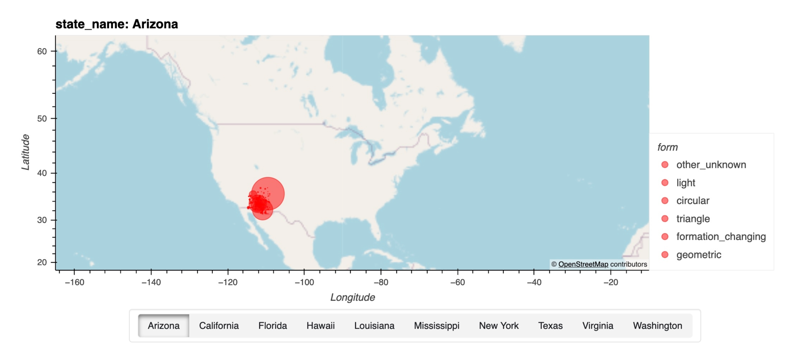


### 5.2 Color-Coding our GeoVisualization Map
To make our map even more interactive we then added colors to the various UFO shapes by defining the shape (form) colors and updating the above code as follows:

    # Ensure that 'longitude' and 'latitude' columns exist and are correctly named
    if 'longitude' in geo_df.columns and 'latitude' in geo_df.columns:
    # Map the form column to corresponding colors using the form_colors dictionary
    geo_df['form_color'] = geo_df['form'].map(form_colors)

    # Plotting using hvplot
    try:
        fig = geo_df.hvplot.points(
            'longitude', 'latitude', geo=True,
            color='form_color',  # Color points based on the form colors
            s='average_duration_hour',  # Size by average duration
            hover_cols=['year', 'city', 'form'],
            groupby=['state_name'],  # Group by state
            widgets={'state_name': pn.widgets.RadioButtonGroup},
            muted_color='white', muted_alpha=0.1,
            alpha=0.5, tiles='OSM',
            xlim=(-165, -10), ylim=(18, 62), widget_location='bottom',
        )

The updated code generated the color coded, interactive map below.

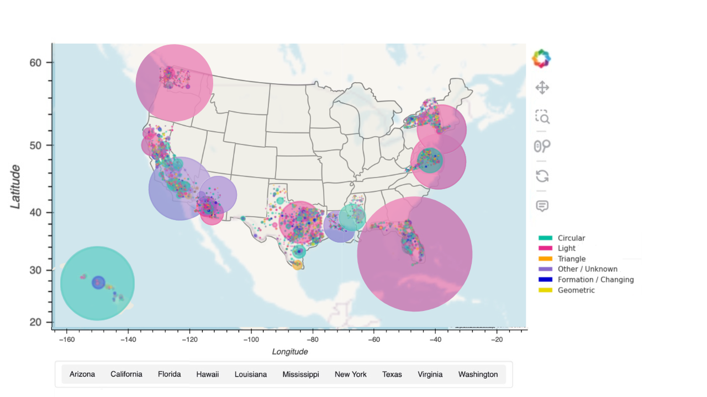


## Installation
Ensure you have the following libraries installed:
  * `pip install pandas numpy matplotlib prophet jupyter_bokeh hvplot prophet seaborn cartopy geoviews`
### Usage
1. Clone the Repository: `git clone https://github.com/EricaYanoshak/Decoding-UFO-Sightings`
2. Navigate to the Project Directory: `cd Decoding-UFO-Sightings`
3. Run the Notebook or Script: `Team_Picard_Final.ipynb`
  * If using Jupyter Notebook: `jupyter notebook Team_Picard_Final.ipynb`
  * If using a Python script: `python Team_Picard_Final.py`

# Results and Answers to Our Questions

### What can we learn about previously documented and recorded UFO sightings?

> As stated previously, and depicted in Figure 1, the number of UFO sightings began to increase steadily after 1993, and from 1994 to mid-2014, the most active states (or the states accounting for 90% of the data) were: Arizona, California, Hawaii, Louisiana, Mississippi, New York, Texas, Virginia, and Washington.

#### Shapes, Space and Time

**Geospatial and Temporal Patterns:** By correlating UFO shapes with geographic and temporal data, we see how can specific shapes are more common in particular time periods, as seen in [Figure 3.1: Frequency, Sum and Mean: UFO Shapes by Year](./Images/Figure_3.1.1_FrequencyDurationbyYear.png) and regions, as seen in [Figure 3.2: National Average Duration of UFO Shapes by Region](./Images/Figure_3.2_NationalAvgDurionbyRegion_optimized.png).
  
* **National Patterns in Frequency**: Despite the difference in culture, generation, and location, the frequency of UFOs by shape has followed a similar pattern nationally. As the below plot shows, duration frequency has increased over time but the pattern has remained fairly consistent since the 1940s.
  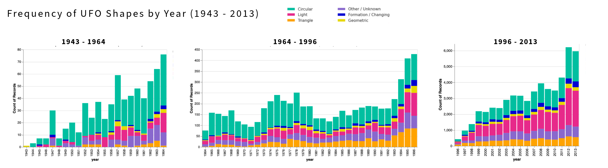

* **Regional Patterns in Duration**: In addition to [Figure 3.2: National Average Duration of UFO Shapes by Region](./Images/Figure_3.2_NationalAvgDurionbyRegion_optimized.png), we can also use our top ten states as a sample to see see similar patterns in shape duration across different regions, with the most consistency along the east coast, and the outlier of the island Hawaii.
  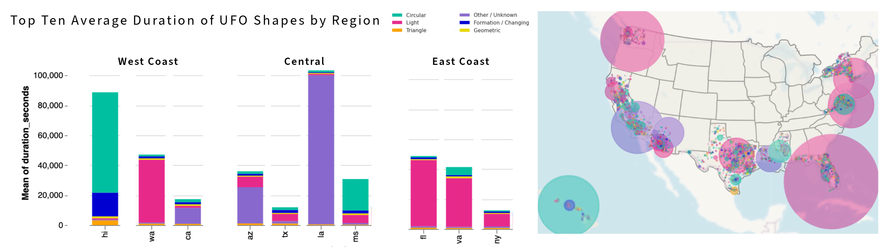

* **Diverse Frequency and Duration**: As seen in [Figure 3.3 Shape Frequency and Duration](./Images/Fig_Shape_Freq_Duration.png), the shape frequencies and duration are not in alignment. For example, Circular shapes have the highest overall frequency but fall below both Light and Unknown / Other shapes in terms of average duration.
  
* **Highest Frequency and Duration**: California has the highest frequency of UFOs of every shape, but a below average duration compared to all 50 states. The opposite can be said for Hawaii, as seen in [Figure 3.2 Duration and Frequency by Shape](./Images/Figure_3.2_TopTen_Count_Duration.png). Hawaii has the highest average duration of Circular, Formation / Changing, Geometric, and Triangle UFO shapes (4 out of 6). With Florida having the highest average duration of Light and Louisiana having the highest duration for Other / Unknown shapes.
     
As the above data shows us, analyzing UFO sightings by shape, location, frequency, and duration over time allows researchers to identify patterns, track trends, and narrow down unexplained cases. Temporal trends can reveal whether specific periods or events trigger a surge in reports, while geographic mapping highlights hotspots that may reflect technological, environmental, or cultural factors. By comparing sighting durations with other variables, researchers can differentiate between natural phenomena, technological experiments, and potentially unknown occurrences. Together, these insights contribute to a clearer understanding of UFO phenomena and help filter out misidentifications and cultural biases.

### Can we use this historical data to predict trends in future UFO sightings?

From the historical data on shape, location, frequency, and duration of UFO sightings in the US, we were able to build a more comprehensive understanding of the phenomena and predict future sightings. We analyzed the data from the visualizations and compiled the results in Table 1 and 2, below.

Table 1: **National Data by Top Ten States**

| State       | 10-Year Trend   | Best Day of Week | Worst Day of Week | Best Time of Year | Best Time of Day* | Highest Frequency | Highest Duration |
|-------------|:---------------:|:----------------:|:-----------------:|:-----------------:|:-----------------:|:-----------------:|:----------------:|
| Arizona     | Slight Decline  | Wednesday        | Friday            | Early March       | Afternoon         | Light             | Other / Unknown  |
| California  | Plateau         | Tuesday          | Sunday            | Early March       | Early Morning     | Circular          | Other / Unknown  |
| Florida     | Plateau         | Saturday         | Thursday          | Late August       | Early Morning     | Light             | Light            |
| Hawaii      | Steady Decline  | Monday           | Thursday          | Early July        | Evening           | Light             | Circular         |
| Louisiana   | Steady Increase | Friday           | Wednesday         | Early January     | Early Morning     | Circular          | Other / Unknown  |
| Mississippi | Steady Increase | Thursday         | Tuesday           | Late December     | Early Morning     | Circular          | Circular         |
| New York    | Steady Increase | Friday           | Sunday            | Late June         | Evening           | Circular          | Light            |
| Texas       | Steady Decline  | Saturday         | Friday            | Mid-September     | Afternoon         | Circular          | Light            |
| Virginia    | Steady Decline  | Sunday           | Saturday          | Mid-August        | Evening           | Circular          | Light            |
| Washington  | Steady Increase | Friday           | Sunday            | Mid-August        | Evening           | Light             | Light            |
| National    | Steady Increase | Friday           | Thursday          | Mid-August        | Early Morning     | Circular          | Light            |

Table 2: **National Data by Shape**

| Shape                | 10-Year Trend  | Best Day of Week | Worst Day of Week | Best Time of Year | Best Time of Day* | Highest Frequency | Highest Duration |
|----------------------|:--------------:|:----------------:|:-----------------:|:-----------------:|:-----------------:|:-----------------:|:----------------:|
| **Light**                | Decline        | Saturday         | Thursday          | Mid-August        | Early Morning     | California        | Florida          |
| **Circular**             | Slight Incline | Monday           | Saturday          | Early January     | Evening           | California        | Hawaii           |
| **Formation / Changing** | Steady Decline | Saturday         | Friday            | Mid-December      | Early Morning     | California        | Hawaii           |
| **Geometric**            | Steady Decline | Thursday         | Saturday          | Late February     | Early Morning     | California        | Hawaii           |
| **Other / Unknown**      | Plateau        | Tuesday          | Wednesday         | Early March       | Early Morning     | California        | Louisiana        |
| **Triangle**             | Plateau        | Sunday           | Saturday          | Late February     | Afternoon         | California        | Hawaii           |

*Time of Day was broken down into the following categories, Early Morning (12:00 AM to 5:59 AM), Morning (6:00 AM to 11:59 PM), Afternoon (12:00 PM to 3:59 PM), Early Evening (4:00 PM to 8:00 PM), and Evening (8:00 PM to 11:59 PM).


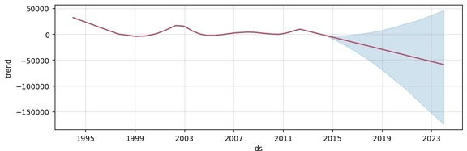

The national trends plot above shows us that from a national perspective, the trends suggest that there will be a slight decline in UFO sightings over the next ten years. [Figure 4.1: National Forecast](./Images/Figure_4.1_NationalTimes.jpeg) shows additional data such as UFO sightings peaking in mid-August and are most likely reported to have occurred on Fridays, and least likely to have occurred on Thursdays, as well as the early morning hours between 1:30 AM and 2:00 AM being the most common time for sightings.

Despite the predicted national decline, not all models showed a decline. Certain US states are predicted to see an increase in sightings as are Circular UFO shapes as seen below.

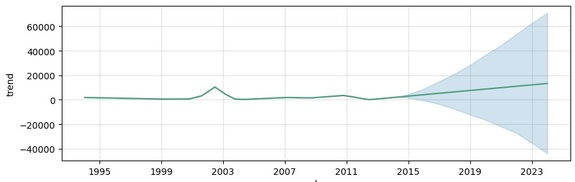

### How can we use these predictions?
Comparing the top ten most active states’ trends to the overall national trend could help a UFO enthusiast target specific locations and time frames for peak viewing or analysis. For example, based on this data we can determine that even though the national trend is moving downward, there are still four states (Louisiana, Mississippi, New York, and Washington) that are expected to see increases and two (California and Florida) that are expected to remain rather consistent. The same can be said for UFO shapes, in that despite the overall decline expected, Circular and Triangular shapes are expected to increase and remain consistent, respectively.

Researchers could focus their efforts towards these states and use the data to plan when to either visit the area in hopes of witnessing a sighting, when to increase data surveillance, and/or how to so in the sense that one may use different tools, spacial views, technology when search for a Light shaped UFOs as opposed to Tringler shaped ones. For example: 

* Using the data from [**Mississippi**](./Images/MI_future_compo.png), UFO enthusiasts might plan a trip (or data analysts might focus on) the later half of December, and [**Florida**, **Washington** and **overall national** events](./Images/Figure_4.1_National_Forcast_Time.png) throughout the month of August.
* They can further narrow down the location, time of day, week and month by shape they are looking to research, such as traveling to Florida in early January to study [**Light Shaped UFOs**](./Images/Figure_4.2.1_LightPredictions.png) during the evening hours, or Mississippi during early March to gather more information on [**Other / Unknown Shaped UFOs**](./Images/Figure_4.2.1_OtherUnknownPredictions.png) in the early morning hours.
* In addition, this work provides the tools needed to see not only a specific state by shape, as in [**Circular Predictions in the state of Hawaii**](./Images/Figure_4.3.1_CirclePredictionsinHI.jpeg), or [**Other / Unknown Predictions in the state of California**](./Images/Figure_4.3.2_OtherUnknownPredictionsinCA.png), but can further be narrowed down by city or a precise geological area as in [**Other / Unknown Predictions in the city Sacramento, CA.**](./Images/Figure_4.3.3_OtherUnknownPredictionsinCASacramento.png)
* Both researchers and enthusiasts can use the shape predictions to pinpoint optimal locations for spotting specific UFO forms. For example, sightings of circular shapes are expected to increase, particularly in Louisiana, Mississippi, and New York—states with high frequencies of these shapes. To maximize the chances of a sighting, one could visit these areas around early July or January, on a Monday, near 11 p.m. EST, based on [**Circular Forecast Trends**](./Images/Figure_4.2_Circle_Forcast_Time.jpeg).

# Noteworthy Pain Points and Learning Experiences
### Year and Index Mismatches
Initially, we were working under the assumption that our dataset ended in 2013. After cleaning the DataFrame and beginning our analysis, we noticed data appearing from 2014. Previous viewing of the ufo_sightings_df and cleaned_us_ufo_df had suggested the final rows were from 2013. We returned to the DataFrame and realized there were indeed sightings from 2014. However, the 2014 data was located approximately at index position 43,000 rather than the 2013 sightings found around index position 80,000 as seen in the code below.


|       | datetime            | city      | state | country | shape  | duration (seconds) | latitude  | longitude   |
|-------|---------------------|-----------|-------|---------|--------|--------------------|-----------|-------------|
| **80327** | 2013-09-09 21:15:00 | nashville | tn    | us      | light  | 600                | 36.165833 | -86.784444  |
| **80328** | 2013-09-09 22:00:00 | boise     | id    | us      | circle | 1200               | 43.613611 | -116.2025   |
| **80329** | 2013-09-09 22:00:00 | napa      | ca    | us      | other  | 1200               | 38.297222 | -122.284444 |
| **80330** | 2013-09-09 22:20:00 | vienna    | va    | us      | circle | 5                  | 38.901111 | -77.265556  |
| **80331** | 2013-09-09 23:00:00 | edmond    | ok    | us      | cigar  | 1020               | 35.652778 | -97.477778  |

___

    # Sorting data by datetime column
    cleaned_us_ufo_df.sort_values(by=['datetime'], inplace=True)
    cleaned_us_ufo_df.shape

    (63099, 8)

___
    cleaned_us_ufo_df.tail(10)

|       | datetime            | city           | state | country | shape     | duration (seconds) | latitude   | longitude  |
|-------|---------------------|----------------|-------|---------|-----------|--------------------|------------|------------|
| **46150** | 2014-05-07 20:30:00 | seagrove beach | fl    | us      | fireball  | 60                 | 30.3183333 | -86.130278 |
| **46152** | 2014-05-07 21:00:00 | theodore       | al    | us      | circle    | 120                | 30.5475    | -88.175278 |
| **46153** | 2014-05-07 21:10:00 | naugatuck      | ct    | us      | unknown   | 300                | 41.4858333 | -73.051111 |
| **46154** | 2014-05-07 21:20:00 | hillsboro      | mo    | us      | fireball  | 360                | 38.2322222 | -90.562778 |
| **46301** | 2014-05-08 0:00:00  | memphis        | tn    | us      | rectangle | 900                | 35.1494444 | -90.048889 |
___
    # Checking range data available in dataset
    display(cleaned_us_ufo_df['datetime'].min())
    cleaned_us_ufo_df['datetime'].max()

    Timestamp('1910-06-01 15:00:00')
    Timestamp('2014-05-08 00:00:00')


We confirmed the true date range and ensured we sorted by datetime. We hypothesized that this 2014 data had been entered before the entry of 2013 data, so it was listed at an earlier index position. The disconnect between index position and chronological position served as a learning experience and reminder that these concepts are indeed unique and that it is worth confirming the minimum and maximum dates within a DataFrame.

### Longitude
Early in our exploration, we wanted to explore using longitude and latitude rather than by state. The initial exploration of this data proved frustrating as we continually received an error that said longitude was the “wrong type.” We attempted to cast it from an object to a float and even an integer, but the error remained. Ultimately, we sought assistance and could convert the pd.to_numeric function to ensure that 'longitude' was of numeric type.

> geo_df['longitude'] = pd.to_numeric(geo_df['longitude'], errors='coerce')

### Color-Coding GeoVisualization Map
Color-coding the shape frequency and duration in the GeoVisualization Map brought additional difficulties in showing all shapes by state and indivdual shapes by state. Therefore we created two maps. 
* The first is a geovisualization of top ten states by shapes, maps out all shapes with corresponding colors per state, as so: 
  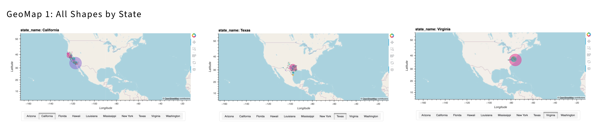

* The second geovisualization enables the user to view the individual shapes by state and is more interactive as the user can zoom in and out to get a more precise view of not only the location, but also of the frequency and duration of each shape per state, as shown below:
  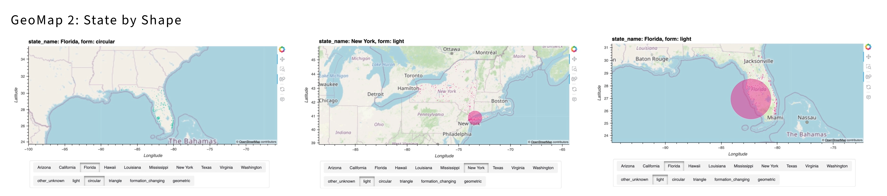


# Opportunities for Further Research
With a now-cleaned database and initial insights on UFO sightings from 1994 to mid-2014, there are opportunities for additional research. We were able to locate NUFORC data up to 2020 from Kaggle, There was insufficient time for us to extract data from engineer duration column as the data was co-mingled with text and there was not consistency on how duration time is captured. It would have required a lot more time and effort to clean it . However, it would be ideal to consider an alternate data source that can provide more recent data that can be cleaned and merged with our DataFrame for a future project.

Also, more time could allow us to look at historical data with a more critical lens. UFO sightings are certainly not a new phenomenon, as demonstrated by our dataset, which contains more than one hundred years of occurrences. As we previously stated, there is undoubtedly a change in the number of sightings, beginning around 1994, and continues through the end of our data.

And while we focused on that approximate twenty-year time frame, there are some very interesting data points prior to that time frame. For example, in [Figure 3.2.1 Mean Duration of Sightings by Year](./Images/Figure_3.2.1_MeanDuration1943to2013.png), we see specific years with very “long” sightings, even though they might not have been as plentiful as a peak year like 2012/2013. 1945 and 1991 also had extremely high average durations and a spike in 1984. Furthermore, looking into the sum durations of these particular years may provide additional insight.

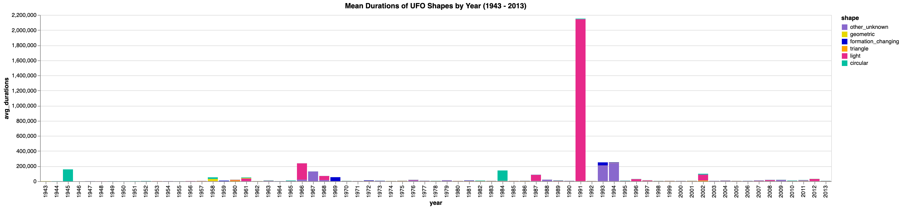
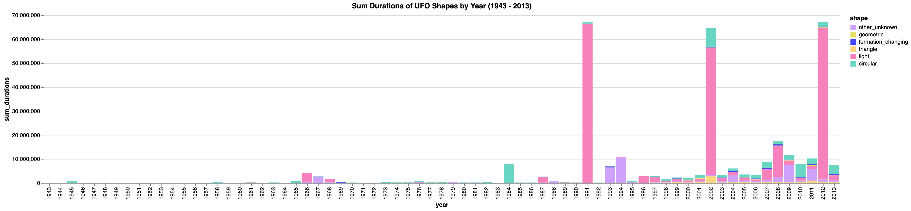

More recent data, coupled with a deeper analysis of historical data could also be beneficial to research how other variables, including holidays, weather events, changes in the geopolitical climate, proximity to military bases, and space launches and locations, might have impacted UFO sightings and provide tools to more precisely predict sightings in the future.

Also, with more time, we would have liked to learn how to overlay plot component visualizations, allowing us to create a single visualization encompassing data from the top-ten states, as well as overall national and global data. Given the vast size of the United States, visualizing data on a global scale could yield invaluable insights, such as whether outlier islands and landmasses follow patterns similar to those of Hawaii and Alaska, or to regions closer to them—or if they exhibit entirely unique patterns.

Furthermore, looking for patterns and comparing the United States with neighboring countries, such as Mexico and Canada, or nearby areas like the Bahamas and the Caribbean, can offer different yet equally valuable insights compared to examining countries and islands in Asia, Europe, and Australia. Both approaches provide invaluable insights into human perception, cultural influence, mass media impact, and potential technological implications. Cataloging and analyzing this data enables researchers to distinguish between unexplained phenomena and misidentifications, while also uncovering the psychological and sociological factors behind UFO reports.

Lastly, with more time, we could expand this analysis to explore ways to expand the data set and use our data and analysis. For example, the data could be used as part of a feasibility study for building applications or services in a new and niche industry: UFO Tourism.

# License
This project is licensed under the [MIT License](./License.txt)

# Resources Consulted and Credits
The following credit must be given for assistance with our project:
* Jeff Paine for his abbreviation_to_name [code](https://gist.github.com/JeffPaine/3083347)
* The curriculum team and Bootcamp Spot for providing us access to the original ufoSightings.csv dataset, which we explored in Module 5.
* Zohaib Khawaja, for helping us find a solution to convert longitude to a numeric so that we could build our geo-visualization.
* [NUFORC](https://nuforc.org/databank/)
* This project utilized assistance from [ChatGPT](https://openai.com/chatgpt), an AI language model developed by OpenAI, for generating code snippets, explanations, and guidance.


This README was last updated on October 8, 2024.